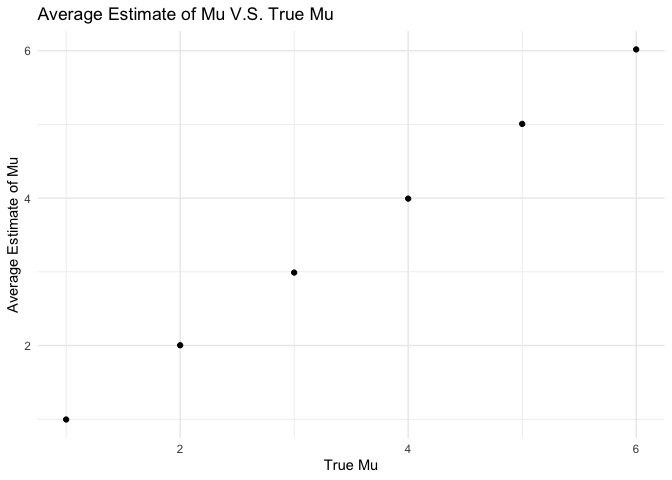
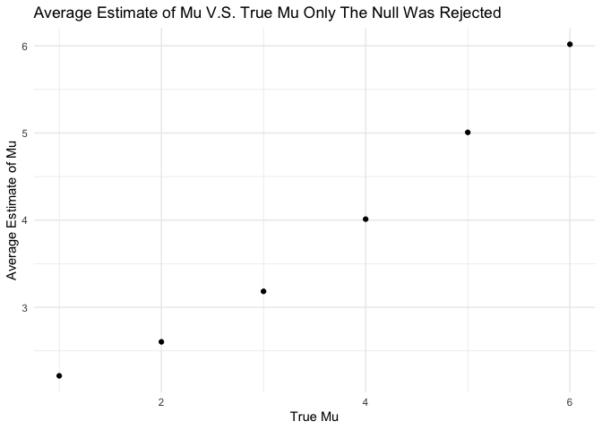

p8105_hw5_ys3637
================
Youlan Shen
2022-11-16

## Set up

``` r
# library all packages that we need at the beginning
library(tidyverse)
```

    ## ── Attaching packages ─────────────────────────────────────── tidyverse 1.3.2 ──
    ## ✔ ggplot2 3.3.6      ✔ purrr   0.3.4 
    ## ✔ tibble  3.1.8      ✔ dplyr   1.0.10
    ## ✔ tidyr   1.2.0      ✔ stringr 1.4.1 
    ## ✔ readr   2.1.2      ✔ forcats 0.5.2 
    ## ── Conflicts ────────────────────────────────────────── tidyverse_conflicts() ──
    ## ✖ dplyr::filter() masks stats::filter()
    ## ✖ dplyr::lag()    masks stats::lag()

``` r
set.seed(1)

# default set up
theme_set(theme_minimal() + theme(legend.position = "bottom"))

options(
  ggplot2.continuous.colour = "viridis",
  ggplot2.continuous.fill = "viridis"
)

scale_colour_discrete = scale_colour_viridis_d
scale_fill_discrete = scale_fill_viridis_d
```

## Problem 2

``` r
# read in data from CSV file
homicide_data <- read_csv("Data/Problem_2_data/homicide-data.csv")
```

    ## Rows: 52179 Columns: 12
    ## ── Column specification ────────────────────────────────────────────────────────
    ## Delimiter: ","
    ## chr (9): uid, victim_last, victim_first, victim_race, victim_age, victim_sex...
    ## dbl (3): reported_date, lat, lon
    ## 
    ## ℹ Use `spec()` to retrieve the full column specification for this data.
    ## ℹ Specify the column types or set `show_col_types = FALSE` to quiet this message.

``` r
# show the first several lines of the original data
homicide_data
```

    ## # A tibble: 52,179 × 12
    ##    uid   repor…¹ victi…² victi…³ victi…⁴ victi…⁵ victi…⁶ city  state   lat   lon
    ##    <chr>   <dbl> <chr>   <chr>   <chr>   <chr>   <chr>   <chr> <chr> <dbl> <dbl>
    ##  1 Alb-…  2.01e7 GARCIA  JUAN    Hispan… 78      Male    Albu… NM     35.1 -107.
    ##  2 Alb-…  2.01e7 MONTOYA CAMERON Hispan… 17      Male    Albu… NM     35.1 -107.
    ##  3 Alb-…  2.01e7 SATTER… VIVIANA White   15      Female  Albu… NM     35.1 -107.
    ##  4 Alb-…  2.01e7 MENDIO… CARLOS  Hispan… 32      Male    Albu… NM     35.1 -107.
    ##  5 Alb-…  2.01e7 MULA    VIVIAN  White   72      Female  Albu… NM     35.1 -107.
    ##  6 Alb-…  2.01e7 BOOK    GERALD… White   91      Female  Albu… NM     35.2 -107.
    ##  7 Alb-…  2.01e7 MALDON… DAVID   Hispan… 52      Male    Albu… NM     35.1 -107.
    ##  8 Alb-…  2.01e7 MALDON… CONNIE  Hispan… 52      Female  Albu… NM     35.1 -107.
    ##  9 Alb-…  2.01e7 MARTIN… GUSTAVO White   56      Male    Albu… NM     35.1 -107.
    ## 10 Alb-…  2.01e7 HERRERA ISRAEL  Hispan… 43      Male    Albu… NM     35.1 -107.
    ## # … with 52,169 more rows, 1 more variable: disposition <chr>, and abbreviated
    ## #   variable names ¹​reported_date, ²​victim_last, ³​victim_first, ⁴​victim_race,
    ## #   ⁵​victim_age, ⁶​victim_sex

This dataset contains 52179 rows and 12 columns, while each row showing
a homicide case in 50 large U.S. cities over the past decade. Variables
include uid (the case id), reported_date(date the case reported),
victim_last, victim_first (victim last and first name), victim_age,
victim_sex, city, state, lat (latitude), lon (longitude), and
disposition (if the case is closed or open, or closed with arrest or
not). There are total 52179 cases, with each row describing case date,
location, victim information, and disposition information.

-   Then, to create a city_state variable, and summarize within cities
    to obtain the total number of homicides and the number of unsolved
    homicides.

``` r
# Create a city_state variable
homicide_data <- homicide_data %>% 
  janitor::clean_names() %>% 
  mutate(city_state = str_c(city, ", ", state))
# show it
homicide_data %>% 
  select(uid, city, state, city_state)
```

    ## # A tibble: 52,179 × 4
    ##    uid        city        state city_state     
    ##    <chr>      <chr>       <chr> <chr>          
    ##  1 Alb-000001 Albuquerque NM    Albuquerque, NM
    ##  2 Alb-000002 Albuquerque NM    Albuquerque, NM
    ##  3 Alb-000003 Albuquerque NM    Albuquerque, NM
    ##  4 Alb-000004 Albuquerque NM    Albuquerque, NM
    ##  5 Alb-000005 Albuquerque NM    Albuquerque, NM
    ##  6 Alb-000006 Albuquerque NM    Albuquerque, NM
    ##  7 Alb-000007 Albuquerque NM    Albuquerque, NM
    ##  8 Alb-000008 Albuquerque NM    Albuquerque, NM
    ##  9 Alb-000009 Albuquerque NM    Albuquerque, NM
    ## 10 Alb-000010 Albuquerque NM    Albuquerque, NM
    ## # … with 52,169 more rows

``` r
# summarize
homicide_data_summary <- homicide_data %>% 
  mutate(unsolved = ifelse(disposition == "Closed by arrest", FALSE, TRUE)) %>% 
  group_by(city_state) %>% 
  summarize(n_homicides = n(),
            n_unsolved = sum(unsolved))
homicide_data_summary
```

    ## # A tibble: 51 × 3
    ##    city_state      n_homicides n_unsolved
    ##    <chr>                 <int>      <int>
    ##  1 Albuquerque, NM         378        146
    ##  2 Atlanta, GA             973        373
    ##  3 Baltimore, MD          2827       1825
    ##  4 Baton Rouge, LA         424        196
    ##  5 Birmingham, AL          800        347
    ##  6 Boston, MA              614        310
    ##  7 Buffalo, NY             521        319
    ##  8 Charlotte, NC           687        206
    ##  9 Chicago, IL            5535       4073
    ## 10 Cincinnati, OH          694        309
    ## # … with 41 more rows

-   For city Baltimore, MD, estimate the proportion of unsolved
    homicides, save as an R object and use broom::tidy, and pull out the
    result.

``` r
# apply the prop test to the Baltimore, MD
prop_test_Bal_MD <- homicide_data_summary %>% 
  filter(city_state == "Baltimore, MD") %>% 
  mutate(prop_test = map2(n_unsolved, n_homicides, ~ prop.test(.x, .y) %>% 
                          broom::tidy())) %>% 
  select(prop_test) %>% 
  unnest(cols = c(prop_test))
# pull the result
prop_test_Bal_MD[c("estimate", "conf.low", "conf.high")]
```

    ## # A tibble: 1 × 3
    ##   estimate conf.low conf.high
    ##      <dbl>    <dbl>     <dbl>
    ## 1    0.646    0.628     0.663

-   Run the prop.test for each city

``` r
# apply the prop test to each city
prop_test_each_city <- homicide_data_summary %>% 
  mutate(prop_test = map2(n_unsolved, n_homicides, ~ prop.test(.x, .y) %>% 
                          broom::tidy())) %>% 
  unnest(cols = c(prop_test))
```

    ## Warning in prop.test(.x, .y): Chi-squared approximation may be incorrect

``` r
# select and tidy the result
prop_test_each_city %>% 
  select(city_state, estimate, conf.low, conf.high)
```

    ## # A tibble: 51 × 4
    ##    city_state      estimate conf.low conf.high
    ##    <chr>              <dbl>    <dbl>     <dbl>
    ##  1 Albuquerque, NM    0.386    0.337     0.438
    ##  2 Atlanta, GA        0.383    0.353     0.415
    ##  3 Baltimore, MD      0.646    0.628     0.663
    ##  4 Baton Rouge, LA    0.462    0.414     0.511
    ##  5 Birmingham, AL     0.434    0.399     0.469
    ##  6 Boston, MA         0.505    0.465     0.545
    ##  7 Buffalo, NY        0.612    0.569     0.654
    ##  8 Charlotte, NC      0.300    0.266     0.336
    ##  9 Chicago, IL        0.736    0.724     0.747
    ## 10 Cincinnati, OH     0.445    0.408     0.483
    ## # … with 41 more rows

-   Create a plot that shows the estimates and CIs for each city

``` r
each_city_estimate <- prop_test_each_city %>% 
  select(city_state, estimate, conf.low, conf.high)
each_city_estimate %>% 
  ggplot(aes(x = fct_reorder(city_state, estimate, max), y = estimate, color = city_state)) + 
  geom_errorbar(aes(ymin = conf.low, ymax = conf.high)) +
  labs(
    title = "Estimate Homicide Propotion And CI For Each City",
    x = "City And State",
    y = "Estimate Homicide Prop and CI"
  )
```

<!-- -->

## Problem 3

-   First generate the dataset and apply the t.test to each data, store
    the p-value

``` r
# create a function generate normal variable X, and fix sample size n=30
# fix sigma = 5, and mu as an unfixed input
# the output of the function is the mu estimate and the p.value of the
# t.test applied on to the generated variable X
muhat_p_value <- function(n = 30, mu, sigma = 5) {
  
  data <- tibble(
    x <- rnorm(n, mean = mu, sd = sigma),
  )
  
  t.test(data, mu = 0, conf.level = 0.95) %>% 
    broom::tidy() %>% 
    select(estimate, p.value)
}
```

-   If Generate 5000 dataset from the model, their mu estimates and
    p.values

``` r
rerun(5000, muhat_p_value(mu = 0)) %>%
        bind_rows
```

    ## # A tibble: 5,000 × 2
    ##    estimate p.value
    ##       <dbl>   <dbl>
    ##  1    0.412  0.629 
    ##  2    0.664  0.368 
    ##  3    0.551  0.534 
    ##  4    0.567  0.487 
    ##  5   -1.65   0.0599
    ##  6    1.19   0.229 
    ##  7    0.334  0.738 
    ##  8   -1.19   0.209 
    ##  9    0.122  0.887 
    ## 10    0.684  0.472 
    ## # … with 4,990 more rows

-   Repeat for true mu is equal to 1, 2, 3, 4, 5, 6

``` r
# create a results_df of true mu, and each estimate and p_value
results_df <-
  tibble(true_mu = c(1, 2, 3, 4, 5, 6)) %>% 
  mutate(
    output_lists = map(.x = true_mu, ~rerun(5000, muhat_p_value(mu = .x))),
    estimate_dfs = map(output_lists, bind_rows)) %>% 
  select(-output_lists) %>% 
  unnest(estimate_dfs)
results_df
```

    ## # A tibble: 30,000 × 3
    ##    true_mu estimate p.value
    ##      <dbl>    <dbl>   <dbl>
    ##  1       1    1.52   0.0865
    ##  2       1    2.11   0.0159
    ##  3       1    2.01   0.0183
    ##  4       1    0.165  0.839 
    ##  5       1    0.108  0.912 
    ##  6       1    1.56   0.0682
    ##  7       1    2.04   0.0252
    ##  8       1    2.40   0.0154
    ##  9       1    2.15   0.0154
    ## 10       1    0.500  0.634 
    ## # … with 29,990 more rows

-   Make a plot showing the proportion of times the null was rejected
    (the power of the test) on the y axis and the true value of μ on the
    x axis.

``` r
# first summary the proportion and then make a plot
results_df %>% 
  mutate(reject = ifelse(p.value < 0.05, TRUE, FALSE)) %>% 
  group_by(true_mu) %>%
  summarize(prop_reject_null = sum(reject) / 5000) %>% 
  ggplot(aes(x = true_mu, y = prop_reject_null)) + 
  geom_point() +
  labs(
    title = "Proportion of Times The Null Was Rejected for Each Mu",
    x = "True Mu",
    y = "Proportion of The Null Was Rejected"
  )
```

<!-- -->

From the plot, when the true mu increases, the proportion of times the
null was rejected also increases, which means, when the sample true mean
is more different from the hypothesis mean (the effect size increases),
we are more easily to reject the null hypothesis.

-   Make a plot showing the average estimate of μ̂ on the y axis and the
    true value of μ on the x axis.

``` r
# first summary the average estimate of mu and then make a plot
results_df %>% 
  group_by(true_mu) %>%
  summarize(avg_estimate = mean(estimate)) %>% 
  ggplot(aes(x = true_mu, y = avg_estimate)) + 
  geom_point() +
  labs(
    title = "Average Estimate of Mu V.S. True Mu",
    x = "True Mu",
    y = "Average Estimate of Mu"
  )
```

<!-- -->

\*Make a second plot (or overlay on the first) the average estimate of μ̂
only in samples for which the null was rejected on the y axis and the
true value of μ on the x axis. Is the sample average of μ̂ across tests
for which the null is rejected approximately equal to the true value of
μ? Why or why not?

``` r
# first summary the average estimate of mu only the null was rejected
# and then make a plot
results_df %>% 
  filter(p.value < 0.05) %>% 
  group_by(true_mu) %>%
  summarize(avg_estimate = mean(estimate)) %>% 
  ggplot(aes(x = true_mu, y = avg_estimate)) + 
  geom_point() +
  labs(
    title = "Average Estimate of Mu V.S. True Mu Only The Null Was Rejected",
    x = "True Mu",
    y = "Average Estimate of Mu"
  )
```

<!-- -->

For the first plot that we include all the dataset, we can see that the
sample average mu is approximately equal to the true mu. However, in the
second plot, which only include **samples for which the null was
rejected**, the sample average mu is not always approximately equal to
the true mu. When the true mu increases, like 4, 5, 6, the sample
average mus are very close to the true mu. But when the true mu is
around 1, 2, the sample average mus are not approximately equal to the
true mu. This result goes along with previous plot. Since when effect
size is small, we cannot easily reject the null, and in the rejected
samples, a small effect size means a little difference on mu will result
in the difference of average mu and true mu.
